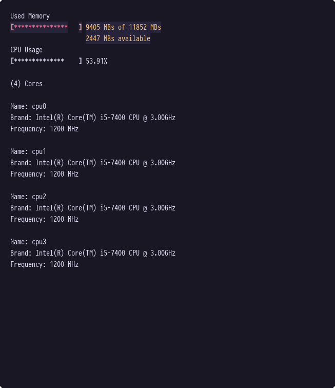

# Cursense

Cursense is a simple and stupid terminal tool based on ncurses to display available CPU, core frequency and used memory.



## How to use it

```bash
git clone <this repo>
cd <this repo>
cargo run
```

If you have cargo-watch installed, you can use it to run the program on file changes:

```bash
cargo watch -x 'run --'
```

## References

- [ncurses cheatsheet](https://github.com/thenamankumar/ncurses-cheatsheet/blob/master/cheatsheet.md)
- [ncurses scroll](https://stackoverflow.com/questions/29565403/how-to-scroll-a-window-other-than-stdscreen-in-ncurses)